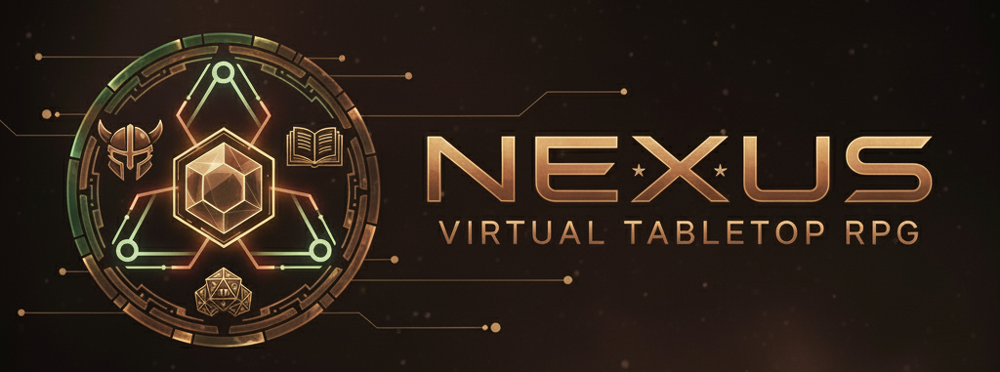

# 🎲 Nexus VTT



**A stunning, lightweight virtual tabletop for modern web browsers**

[](https://opensource.org/licenses/MIT)
[](https://typescriptlang.org/)
[](https://reactjs.org/)
[](https://uxdesign.cc/glassmorphism-in-user-interfaces-1f39bb1308c9)

## ✨ Features

### 🎨 **Stunning Glassmorphism Design**
- **Translucent glass panels** with backdrop blur effects
- **Smooth animations** and interactive hover states  
- **Modern gradient backgrounds** with floating particles
- **Responsive design** for desktop, tablet, and mobile

### 🎲 **Real-time Multiplayer Gaming**
- **Instant session creation** with 4-character room codes
- **Host/Player roles** - DM controls, players participate
- **Live dice rolling** with full expression support (2d6+3, 1d20, etc.)
- **Real-time synchronization** across all connected players

### 🏗️ **Hybrid Architecture**
- **Client-side authority** - game logic runs in host's browser
- **Minimal server** - just routes messages between players
- **No database required** - state persists locally via IndexedDB
- **Lightning fast** - instant responses, zero server lag

### 🛠️ **Developer-Friendly**
- **Modern TypeScript** codebase with full type safety
- **Hot module reloading** for rapid development
- **Intelligent port management** - auto-resolves conflicts
- **Comprehensive debugging** tools and logging

## 🚀 Quick Start

### Prerequisites
- **Node.js 18+** and npm
- Modern web browser (Chrome, Firefox, Safari, Edge)

### Installation & Setup

```bash
# Clone the repository
git clone https://github.com/your-username/nexus-vtt.git
cd nexus-vtt

# Install all dependencies
npm install

# Start everything with one command
npm run start:all
```

The setup will start:
- ✅ **Frontend** on http://localhost:5173
- ✅ **Backend Server** on http://localhost:5000 (WebSocket + Assets)

### Alternative Setup Methods

```bash
# Interactive setup menu (recommended for first time)
npm run setup

# Start individual services
npm run dev          # Frontend only
npm run server:dev   # Backend server (WebSocket + Assets)
```

## 🎯 Usage

### Creating a Game
1. **Enter your name** in the lobby
2. **Click "Host Game"** - you'll get a room code like "BOT1" 
3. **Share the room code** with your players
4. **Start playing!** Use the dice roller and prepare for upcoming features

### Joining a Game
1. **Enter your name** in the lobby
2. **Enter the room code** from your DM
3. **Click "Join Game"** 
4. **You're connected!** Roll dice and interact with other players

### Current Features (MVCR Complete)
- ✅ **Session Management** - Create/join games with room codes
- ✅ **Multi-tab Interface** - Lobby, Dice, Scenes, Settings
- ✅ **Real-time Dice Roller** - Full expression parsing with shared results
- ✅ **Scene Editor** - Background images, grid system, basic scene management
- ✅ **Asset Browser** - A professional asset browser with search, filtering, and caching.
- ✅ **Settings Panel** - A comprehensive settings panel for user customization.
- ✅ **Player Management** - See who's connected in real-time
- ✅ **Color Schemes** - Customizable glassmorphism themes

## 🗂️ Project Structure

```
nexus-vtt/
├── src/                    # React frontend application
│   ├── components/         # React components (Lobby, DiceRoller, Layout, Settings, AssetBrowser)
│   ├── stores/            # Zustand state management
│   ├── types/             # TypeScript type definitions
│   ├── utils/             # WebSocket service, dice utilities
│   └── styles/            # Glassmorphism CSS styling
├── server/                 # Minimal WebSocket relay server
│   ├── index.ts           # Main server with port management
│   └── types.ts           # Server type definitions
├── public/                 # Static assets
│   └── assets/            # Organized graphics and icons
├── scripts/               # Development and asset management scripts
└── docs/                  # Documentation and guides
```

## 🎨 Asset Management

### Adding Your Graphics
```bash
# Process your asset collection
node scripts/process-assets.js /path/to/your/assets ./asset-server/assets

# Example: Process maps from external drive
node scripts/process-assets.js /Volumes/PS2000w/DnD_Assets/maps ./asset-server/assets

# Start asset server
cd asset-server && npm run dev
```

### Supported Asset Types
- **Maps**: Dungeons, cities, wilderness, interiors, battlemaps
- **Tokens**: Characters, monsters, objects, NPCs
- **Art**: Character portraits, scene art, concept art
- **Handouts**: Documents, letters, notices, player maps
- **Reference**: Rules, charts, tables, guides

### Asset Processing Features
- **WebP Conversion**: Reduces file sizes by ~40% while maintaining quality
- **Thumbnail Generation**: 300x300 previews for fast browsing
- **Smart Categorization**: Automatic organization by content type
- **Metadata Extraction**: Searchable tags and descriptions
- **Standardized Structure**: Organized folder hierarchy

### Asset Browser Integration
The Scene Editor includes a professional asset browser:
- 🔍 **Search and filter** by name, category, or tags
- 📁 **Category organization** with subcategories
- 🖼️ **Thumbnail grid** for quick visual selection
- ⚡ **Lazy loading** with smart caching
- 📱 **Mobile responsive** design

## 🛠️ Development

### Available Scripts

#### 🚀 **Quick Start Commands**
```bash
npm run start:all        # Start all servers (frontend + backend + assets) - Full development
npm run dev              # Start frontend only - Quick UI development
npm run setup           # Interactive setup menu (recommended for first time)
npm run dev:all         # Alternative all-in-one development start
npm run start:full      # Start with named process output
```

#### 📋 **When to Use Which Command**
- **`npm run dev`** - Frontend only, perfect for UI work and offline preparation mode
- **`npm run start:all`** - Full stack, needed for multiplayer features and WebSocket server
- **`npm run setup`** - First time setup with intelligent port conflict resolution

#### 🖥️ **Development - Frontend**
```bash
npm run dev              # Start frontend only (port 5173) - Quick UI development
npm run dev:3000         # Start frontend on port 3000
npm run dev:4000         # Start frontend on port 4000
npm run dev:8080         # Start frontend on port 8080
npm run preview          # Preview production build
```

#### 🔌 **Development - Backend/WebSocket**
```bash
npm run server:dev       # Start WebSocket server (port 5000)
npm run server:dev:5001  # Start WebSocket server on port 5001
npm run server:dev:5002  # Start WebSocket server on port 5002
npm run server:dev:8080  # Start WebSocket server on port 8080
npm run server:test      # Run server in test mode
```

#### 🏗️ **Build Commands**
```bash
npm run build           # Production build (frontend)
npm run build:server    # Build server TypeScript
npm run build:all       # Build both frontend and server
npm run server:build    # Same as build:server
npm run server:start    # Start production server (after build)
```

#### 🧪 **Testing & Quality**
```bash
# Type Checking & Linting
npm run type-check      # TypeScript validation only
npm run lint            # ESLint + TypeScript checks

# Unit & Integration Tests
npm run test            # Start test suite in watch mode
npm run test:unit       # Run unit tests only
npm run test:integration # Run integration tests
npm run test:e2e        # Run end-to-end tests
npm run test:all        # Run all tests once
npm run test:watch      # Run tests in watch mode
npm run test:coverage   # Run tests with coverage report
npm run test:ui         # Open Vitest UI

# Visual & Layout Tests
npm run test:layout     # Run Playwright layout tests
npm run test:layout:quick # Quick layout validation
npm run test:visual     # Visual regression testing
```

#### 🐳 **Docker Commands**
```bash
npm run docker:dev      # Start development environment
npm run docker:dev:build # Build and start dev environment
npm run docker:dev:down # Stop development environment
npm run docker:build   # Production build with Docker
npm run docker:deploy  # Deploy to production
npm run docker:logs    # View container logs
npm run docker:setup   # Full Docker environment setup
```

#### 🎨 **Asset Management**
```bash
npm run organize-assets # Organize asset directory structure
npm run update-assets  # Update asset references in code
npm run check-ports    # Check available ports

# Manual asset processing
node scripts/process-assets.js <input> <output>  # Process assets
npm install sharp      # Install image processing library
```

#### 🔧 **Development Tools**
```bash
npm run validate-layout # Validate CSS layout rules
npm run validate-env   # Validate environment configuration
npm run setup:legacy   # Legacy setup script
npm run dev:quick      # Quick development start (alias)
```

#### 📦 **Legacy & Utility**
```bash
npm run prepare        # Husky git hooks setup (auto-run on install)
```

### Architecture Deep Dive

#### Frontend (React + TypeScript)
- **Zustand + Immer**: Immutable state management with reactive updates
- **WebSocket Service**: Robust connection handling with auto-reconnect
- **Asset Manager**: Smart caching and lazy loading for images
- **Component Architecture**: Modular design with glassmorphism styling
- **Type Safety**: Full TypeScript coverage with strict mode

#### Backend (Node.js + WebSocket)
- **Minimal Relay**: ~300 lines of code, just routes messages
- **Room Management**: 4-character codes, host/player roles
- **No Game Logic**: All logic runs in host browser
- **Port Intelligence**: Auto-detects conflicts, suggests alternatives

#### Asset Server (Express.js + Sharp)
- **Image Processing**: Converts all images to optimized WebP format
- **Smart Caching**: HTTP caching headers and client-side IndexedDB
- **RESTful API**: Search, categorization, and metadata endpoints
- **Standardized Structure**: Organized asset hierarchy
- **CORS Support**: Cross-origin requests for development

#### State Synchronization
```typescript
// Host browser: Source of truth
Host makes change → Generate event → Send to server → Broadcast to players

// Player browsers: Apply updates  
Receive event → Update local state → Re-render UI

// Asset Server: Serve optimized content
Request asset → Check cache → Serve WebP/thumbnail → Update manifest

// Server: Message router only
Receive message → Route to room members → No processing
```

## 🚧 Roadmap

### Phase 1: Scene Management (In Progress)
- [x] **Interactive battle maps** with background images
- [x] **Grid system** with customizable spacing and snapping  
- [ ] **Pan and zoom** controls for navigation
- [ ] **Scene switching** for multiple encounters

### Phase 2: Token System
- [ ] **Character and NPC tokens** with drag-and-drop movement
- [ ] **Token library** for organizing character art
- [ ] **Health and status tracking** with visual indicators
- [ ] **Multi-select** and group movement

### Phase 3: Initiative & Combat  
- [ ] **Initiative tracker** with automatic turn management
- [ ] **Combat flow** with round counting and turn indicators
- [ ] **Status effects** and condition management
- [ ] **Integrated dice rolling** for attacks and saves

### Phase 4: Drawing & Measurement
- [ ] **Drawing tools** for tactical annotations
- [ ] **Measurement tools** for distance and area
- [ ] **Real-time collaboration** on drawings
- [ ] **Layer management** for organization

### Phase 5: Advanced Features
- [ ] **Fog of war** and dynamic lighting
- [ ] **Hex grid support** and grid-less mode
- [ ] **Session persistence** and save/load
- [ ] **Asset sharing** and template system

## 🤝 Contributing

We welcome contributions! Here's how to get started:

1. **Fork** the repository
2. **Create** a feature branch: `git checkout -b feature/amazing-feature`
3. **Make** your changes and test thoroughly
4. **Commit** with clear messages: `git commit -m 'Add amazing feature'`
5. **Push** to your branch: `git push origin feature/amazing-feature`
6. **Open** a Pull Request

### Development Guidelines
- **Follow TypeScript best practices** with strict typing
- **Maintain glassmorphism design consistency** 
- **Test on multiple browsers** and screen sizes
- **Update documentation** for new features
- **Keep the hybrid architecture** - minimal server, client authority

See [CONTRIBUTING.md](CONTRIBUTING.md) for detailed guidelines.

## 📄 License

This project is licensed under the MIT License - see the [LICENSE](LICENSE) file for details.

## 🎮 Inspiration

Nexus VTT is inspired by the brilliant architecture of [Ogres VTT](https://github.com/samcf/ogres) by samcf. We've preserved the genius hybrid client-server design while modernizing the technology stack and adding stunning glassmorphism aesthetics.

## 🔗 Links

- **Live Demo**: [Coming Soon]
- **Documentation**: [Wiki](https://github.com/your-username/nexus-vtt/wiki)
- **Issues**: [Bug Reports & Feature Requests](https://github.com/your-username/nexus-vtt/issues)
- **Discussions**: [Community Chat](https://github.com/your-username/nexus-vtt/discussions)

## 📊 Stats


---

**Built with ❤️ for the tabletop gaming community**

*Ready to revolutionize your virtual game nights? Start rolling! 🎲*
